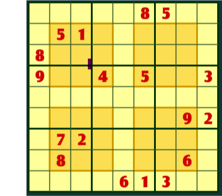
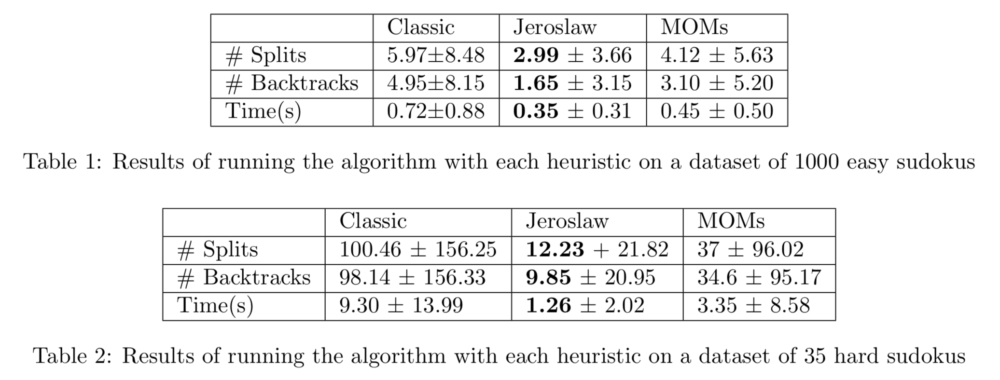
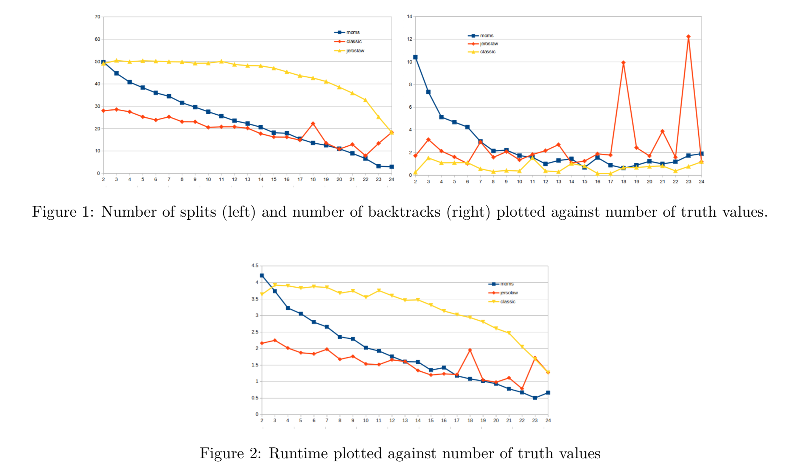

# Sudoku SAT solver

## Description

  

A SAT solver which solves Sudoku problems.

This SAT solver algorithm is fully general, in the sense that it is an algorithm to solve not only Sudoku's formulated in SAT, but any SAT problem (at least in principle, given enough time and memory).

# Project

  

  

- [Report](2-RNNs/gatopoulos_report_assignment2.pdf) and [code](2-RNNs/)

# Execution

To execute the SAT solver:
i)  move to this directory within the terminal
ii) type as command 'SAT -Sn inputfile' 

where 
- SAT is the name of the program, 
- n=1 for the basic DP, n=2 for Jeroslow-Wang or n=3 for MOM's method 
- and the input file is the a TXT in DIMACS format. 

For example: `SAT -S2 sudoku.txt` will solve the DIMACS file 'sudoku.txt' with MOM's method.

The output would be in form 'file.out' and it will appear in this very directory.
For example, the output of the previous example would be 'sudoku.txt.out' and it can be opened with any text editor.
